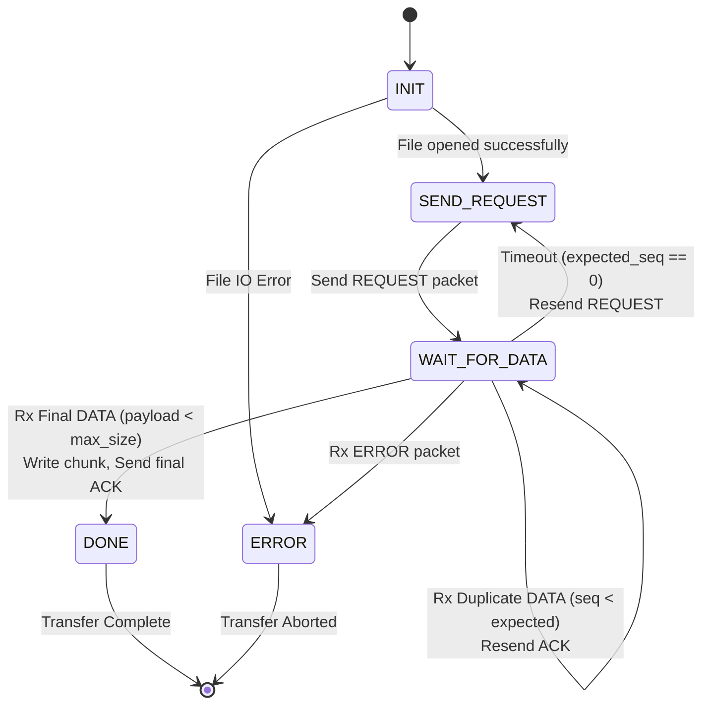
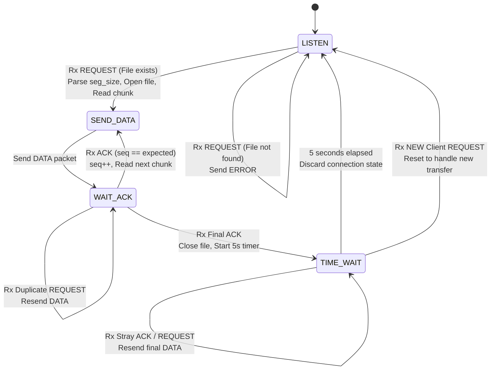

# Lab 3

## Setup
1. `cd lab3/`
2. Install the [uv python package manager](https://docs.astral.sh/uv/getting-started/installation) for your system.
3. `uv sync`

## Protocol State Machines

### Client Architecture


### Server Architecture


## Testing Application Layer Defined Reliable Data Transfer (RDT) over UDP
### Part 1

1. Start the server process:
```sh
uv run server.py 8080
```

2. Start the client in a separate terminal to begin the file transfer:
```sh
uv run client.py 127.0.0.1 8080 test.txt --segment-size 512
```
> Note: The file you specify must exist in the `data/` directory.

### Part 2